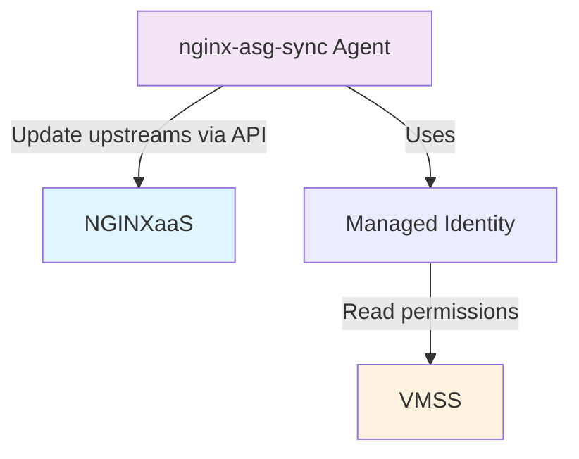

# NGINXaaS for Azure - Virtual Machine Scale Sets (VMSS) Backend Integration

This document provides comprehensive guidance for integrating nginx-asg-sync with [NGINXaaS for Azure](https://docs.nginx.com/nginxaas/azure)
to enable automatic scaling with Azure Virtual Machine Scale Sets (VMSS).

## Overview

F5 NGINXaaS for Azure provides seamless integration with Azure Virtual Machine Scale Sets (VMSS) through dynamic upstream
management. This feature enables automatic scaling of your application backend without requiring manual NGINX configuration
updates when VMSS instances are added or removed.

With VMSS backend integration, you can:

- Automatically sync VMSS instance IP addresses to NGINX upstreams
- Scale VMSS instances out and in without NGINX configuration changes

## Architecture



The nginx-asg-sync agent monitors your VMSS for scaling changes and automatically updates the NGINXaaS upstream configuration
via the dataplane API. This ensures that traffic is distributed to all instances without manual intervention.

## Prerequisites

Before setting up VMSS backend integration, ensure you have:

- An active NGINXaaS for Azure deployment
- Azure Virtual Machine Scale Sets (VMSS)
- Network connectivity between NGINXaaS and VMSS instances
- An Azure VM or container to run the nginx-asg-sync agent
- Appropriate Azure permissions to assign managed identities

## Getting Started

### 1. Create NGINXaaS deployment with dynamic upstreams

Create an [NGINXaaS deployment](https://docs.nginx.com/nginxaas/azure/getting-started/create-deployment), then create an
NGINX configuration with dynamic upstreams that will be managed by the
nginx-asg-sync agent. The upstream must meet these requirements:

- The upstream cannot have any static servers defined via the `server` directive
- The upstream must have a shared memory [zone](https://nginx.org/en/docs/http/ngx_http_upstream_module.html#zone) defined
- The upstream must have a [state](https://nginx.org/en/docs/http/ngx_http_upstream_module.html#state) file declared

Example NGINX configuration:

```nginx
http{
    upstream backend-one {
        zone backend-one 64k;
        state /opt/nginx/state/backend-one.conf;
    }

    upstream backend-two {
        zone backend-two 64k;
        state /opt/nginx/state/backend-two.conf;
    }

    server {
        listen 80;

        status_zone backend;

        location /backend-one {
            proxy_set_header Host $host;
            proxy_pass http://backend-one;
        }

        location @hc-backend-one {
            internal;
            proxy_connect_timeout 1s;
            proxy_read_timeout 1s;
            proxy_send_timeout 1s;

            proxy_pass http://backend-one;
            health_check interval=1s mandatory;
        }

        location /backend-two {
            proxy_set_header Host $host;
            proxy_pass http://backend-two;
        }

        location @hc-backend-two {
            internal;
            proxy_connect_timeout 1s;
            proxy_read_timeout 1s;
            proxy_send_timeout 1s;

            proxy_pass http://backend-two;
            health_check interval=1s mandatory;
        }
    }
}
```

**Important**: It is strongly recommended to add active health checks for your upstreams using VMSS backend. This will
prevent traffic from being routed to an unready VMSS instance and ensure better reliability during scaling operations.

Apply this [NGINX configuration](https://docs.nginx.com/nginxaas/azure/getting-started/nginx-configuration/overview/) to
your NGINXaaS deployment.

### 2. Ensure network connectivity

Ensure network connectivity between your existing Azure Virtual Machine Scale Sets (VMSS) and NGINXaaS deployment:

- Ensure network connectivity between the subnet delegated to the NGINXaaS deployment and VMSS. For example, the VMSS
and NGINXaaS deployment can run on the same Azure VNET or on peered VNETs.

### 3. Create NGINXaaS dataplane API key

Create a [dataplane API key](https://docs.nginx.com/nginxaas/azure/quickstart/dataplane-api-key/) that the
nginx-asg-sync agent will use to authenticate with your NGINXaaS deployment.

Make note of:

- The API key value (you'll need this for the nginx-asg-sync configuration)
- The dataplane API endpoint (you'll need this with the `/nplus` suffix)

### 4. Create VM for nginx-asg-sync agent

Create an Azure VM that will run the nginx-asg-sync agent. For detailed instructions on creating VMs, see the [Azure documentation](https://learn.microsoft.com/en-us/azure/virtual-machines/linux/quick-create-portal).

### 5. Assign managed identity permissions

#### Important: Permissions and Scope Vary by VMSS Orchestration Mode

**Uniform VMSS:**

- The following permissions are sufficient for uniform mode:
  - `Microsoft.Compute/virtualMachineScaleSets/read`
  - `Microsoft.Compute/virtualMachineScaleSets/networkInterfaces/read`

- You can assign the custom role at the **VMSS resource scope**
(recommended to allow application least privileges necessary for its activities).

**Flexible VMSS:**

- Flexible mode requires additional permissions:
  - `Microsoft.Compute/virtualMachineScaleSets/read`
  - `Microsoft.Compute/virtualMachineScaleSets/networkInterfaces/read`
  - `Microsoft.Compute/virtualMachineScaleSets/virtualMachines/read`
  - `Microsoft.Compute/virtualMachines/read`
  - `Microsoft.Network/networkInterfaces/read`

- For flexible mode, you **must assign the custom role at the resource group level** (not just the VMSS scope),
because the agent needs to read individual VM and NIC resources that are not children of the VMSS resource.

nginx-asg-sync uses the Azure API to read the IP addresses of the Virtual Machine Scale Set.
To access the Azure API, nginx-asg-sync must run in an environment with appropriate permissions over the VMSS backend.
This section configures a system-assigned managed identity with the minimum required permissions.

You can assign managed identity permissions using:

- **Azure Portal**:
  - For system-assigned identity: Navigate to your nginx-asg-sync VM resource → **Identity**
  - For role assignment: Navigate to your VMSS resource → **Access control (IAM)** → **Role assignments**
- **Azure CLI**: Use Azure CLI commands for programmatic assignment

For detailed instructions on managed identities, see the [Azure documentation](https://learn.microsoft.com/en-us/azure/active-directory/managed-identities-azure-resources/overview).

The following steps show the Azure CLI approach:

#### Enable System Assigned Managed Identity on the VM

Enable system-assigned managed identity on your nginx-asg-sync VM:

```bash
# Set variables
vmName="sync-agent-vm"
vmResourceGroup="myResourceGroup"
vmssResourceGroup="myVmssResourceGroup"
vmssName="backend-one-vmss"
subscriptionId=$(az account show --query id --output tsv)

# Enable system-assigned managed identity on VM
az vm identity assign \
  --resource-group $vmResourceGroup \
  --name $vmName
```

#### Get the VM's Managed Identity Principal ID

Retrieve the principal ID of the VM's system-assigned managed identity:

```bash
# Get the identity's principal ID
principalId=$(az vm show \
  --resource-group $vmResourceGroup \
  --name $vmName \
  --query identity.principalId \
  --output tsv)
```

#### Create the Custom Role

Create a custom role with only the necessary permissions for nginx-asg-sync:

Create a file called `vmss-network-read-role.json`:

```json
{
  "Name": "VMSS-Network-Read-Role",
  "Description": "Read VMSS and VMSS network interface information",
  "Actions": [
    "Microsoft.Compute/virtualMachineScaleSets/read",
    "Microsoft.Compute/virtualMachineScaleSets/networkInterfaces/read"
  ],
  "NotActions": [],
  "AssignableScopes": [
    "/subscriptions/<SUBSCRIPTION_ID>"
  ]
}
```

```bash
# Replace subscription ID in the JSON file (if using the template above)

# Create the custom role
az role definition create \
  --role-definition vmss-network-read-role.json
```

#### Get the VMSS Resource ID (Scope)

Get the full resource ID of your VMSS to use as the scope for role assignment:

```bash
# Get VMSS resource ID
vmssId=$(az vmss show \
  --resource-group $vmssResourceGroup \
  --name $vmssName \
  --query id \
  --output tsv)
```

#### Assign the Custom Role to the VM's Managed Identity

Assign the custom role to the VM's system-assigned managed identity:

```bash
# Set role name for assignment
roleName="VMSS-Network-Read-Role"

# Assign the custom role to the VM's managed identity
# For uniform VMSS, use the VMSS resource ID as scope:
az role assignment create \
  --assignee-object-id $principalId \
  --assignee-principal-type ServicePrincipal \
  --role $roleName \
  --scope $vmssId

# For flexible VMSS, use the resource group as scope:
# az role assignment create \
#   --assignee-object-id $principalId \
#   --assignee-principal-type ServicePrincipal \
#   --role $roleName \
#   --scope /subscriptions/<SUBSCRIPTION_ID>/resourceGroups/<RESOURCE_GROUP_NAME>
```

#### Verify Role Assignment

Verify that the role assignment was created successfully:

```bash
# Verify role assignment
az role assignment list \
  --assignee $principalId \
  --all \
  --output table
```

**Note**: After creating the role assignment, it may take a few minutes for the permissions to take effect across Azure
services.

### 6. Install nginx-asg-sync agent

The nginx-asg-sync agent can be installed on Azure VM, run as a Docker container, or deployed using Azure Container
Instances (ACI).
Download and install the agent after configuring managed identity permissions.

#### Option A: Install on Azure VM

Install nginx-asg-sync agent on the VM you created in [Create VM for nginx-asg-sync agent](#4-create-vm-for-nginx-asg-sync-agent):

```bash
# SSH into the VM and install
# Get latest version and detect architecture
VERSION=$(curl -sL https://api.github.com/repos/nginx/nginx-asg-sync/releases/latest | grep tag_name | cut -d '"' -f 4 | sed 's/^v//')
if [ -z "$VERSION" ]; then
    echo "Failed to fetch latest version, using fallback version 1.0.2"
    VERSION="1.0.2"
fi
BASE_URL="https://github.com/nginxinc/nginx-asg-sync/releases/download/v${VERSION}"

ARCH=$(uname -m)
case "$ARCH" in
  x86_64) ARCH="amd64" ;;
  aarch64) ARCH="arm64" ;;
  *) echo "Unsupported architecture" && exit 1 ;;
esac

# Download and install nginx-asg-sync
curl -LO "${BASE_URL}/nginx-asg-sync_${VERSION}_linux_${ARCH}.tar.gz"
tar -xzf "nginx-asg-sync_${VERSION}_linux_${ARCH}.tar.gz"
chmod +x nginx-asg-sync
sudo mv nginx-asg-sync /usr/local/bin/

# Verify installation
ls -la /usr/local/bin/nginx-asg-sync

# Create configuration directory
sudo mkdir -p /etc/nginx/
```

**Next Steps**: After installation, proceed to [Configure nginx-asg-sync agent](#7-configure-nginx-asg-sync-agent) to
create the configuration file and start the agent.

#### Option B: Run as Container

Deploy nginx-asg-sync as a container using Docker. The host system (VM or other compute resource) running the container
must have a managed identity with appropriate VMSS permissions configured as described in
[Assign managed identity permissions](#5-assign-managed-identity-permissions):

```bash
# Pull the Docker image
docker pull docker-registry.nginx.com/nginx/asg-sync

# Create the configuration file (config.yaml) in your current directory
# (See Step 7 for the complete configuration file content)

# Run nginx-asg-sync container
docker run --rm -it \
  -v $(pwd)/config.yaml:/etc/nginx/config.yaml \
  -e CONFIG_PATH=/etc/nginx/config.yaml \
  docker-registry.nginx.com/nginx/asg-sync:latest \
  /nginx-asg-sync -config_path /etc/nginx/config.yaml
```

#### Option C: Run on Azure Container Instances (ACI)

Deploy nginx-asg-sync as an Azure Container Instance with persistent configuration stored in Azure Files.
[Azure Container Instances (ACI)](https://learn.microsoft.com/en-us/azure/container-instances/) provides a
serverless way to run containerized applications without managing virtual machines. ACI is ideal for scenarios
that need on-demand, burstable, and pay-per-execution container workloads:

##### Step 1: Create Azure Storage Account

Create a storage account to store the nginx-asg-sync configuration file:

```bash
# Set variables
resourceGroup="myResourceGroup"
storageAccountName="nginxasgsyncconfig"
location="eastus"

# Create storage account
az storage account create \
  --resource-group $resourceGroup \
  --name $storageAccountName \
  --location $location \
  --sku Standard_LRS
```

##### Step 2: Create File Share

Create a file share within the storage account:

```bash
# Create file share for configuration
az storage share create \
  --account-name $storageAccountName \
  --name configshare
```

##### Step 3: Upload Configuration File

Upload your nginx-asg-sync configuration file to the file share. Create the `config.yaml` file using
the content described in [Configuration file](#configuration-file):

```bash
# Upload config.yaml to file share
az storage file upload \
  --account-name $storageAccountName \
  --share-name configshare \
  --source config.yaml
```

##### Step 4: Create User-Assigned Managed Identity and Assign VMSS Permissions

Create a user-assigned managed identity and assign the custom role for VMSS access.
Use or create the same custom role as mentioned in [Create the Custom Role](#create-the-custom-role):

```bash
# Create user-assigned managed identity
az identity create \
  --resource-group $resourceGroup \
  --name nginx-asg-sync-identity \
  --location $location

# Get managed identity IDs
IDENTITY_ID=$(az identity show \
  --resource-group $resourceGroup \
  --name nginx-asg-sync-identity \
  --query id -o tsv)

IDENTITY_CLIENT_ID=$(az identity show \
  --resource-group $resourceGroup \
  --name nginx-asg-sync-identity \
  --query clientId -o tsv)

IDENTITY_PRINCIPAL_ID=$(az identity show \
  --resource-group $resourceGroup \
  --name nginx-asg-sync-identity \
  --query principalId -o tsv)

# Set VMSS variables
vmssResourceGroup="myVmssResourceGroup"
vmssName="backend-one-vmss"
roleName="VMSS-Network-Read-Role"

# Get VMSS resource ID
vmssId=$(az vmss show \
  --resource-group $vmssResourceGroup \
  --name $vmssName \
  --query id \
  --output tsv)

# Assign the custom role to user-assigned managed identity
az role assignment create \
  --assignee-object-id $IDENTITY_PRINCIPAL_ID \
  --assignee-principal-type ServicePrincipal \
  --role $roleName \
  --scope $vmssId
# For flexible VMSS, assign at the resource group scope:
# az role assignment create \
#   --assignee-object-id $IDENTITY_PRINCIPAL_ID \
#   --assignee-principal-type ServicePrincipal \
#   --role $roleName \
#   --scope /subscriptions/<SUBSCRIPTION_ID>/resourceGroups/<RESOURCE_GROUP_NAME>
```

##### Step 5: Create Container Instance

Deploy the nginx-asg-sync container instance with the user-assigned managed identity that has proper VMSS permissions:

```bash
# Set ACI variables
aciName="nginx-asg-sync-aci"
containerImage="docker-registry.nginx.com/nginx/asg-sync:latest"

# Get storage account key
storageKey=$(az storage account keys list \
  --resource-group $resourceGroup \
  --account-name $storageAccountName \
  --query '[0].value' \
  --output tsv)

# Create container instance with user-assigned managed identity
az container create \
  --resource-group $resourceGroup \
  --name $aciName \
  --image $containerImage \
  --location $location \
  --os-type Linux \
  --cpu 1 \
  --memory 1.5 \
  --restart-policy Always \
  --assign-identity $IDENTITY_ID \
  --environment-variables AZURE_CLIENT_ID=$IDENTITY_CLIENT_ID \
  --command-line "/nginx-asg-sync -config_path /etc/nginx/config.yaml" \
  --azure-file-volume-account-name $storageAccountName \
  --azure-file-volume-account-key $storageKey \
  --azure-file-volume-share-name configshare \
  --azure-file-volume-mount-path /etc/nginx
```

##### Step 6: Verify ACI Deployment

Check that the container instance is running successfully:

```bash
# Check container status
az container show \
  --resource-group $resourceGroup \
  --name $aciName \
  --query "{Status:instanceView.state}" \
  --output table

# View container logs
az container logs \
  --resource-group $resourceGroup \
  --name $aciName

# For streaming logs (real-time)
az container attach \
  --resource-group $resourceGroup \
  --name $aciName
```

Example output when the container starts successfully:

```text
2025/12/31 10:25:30 nginx-asg-sync version v1.0.3
2025/12/31 10:25:30 Updated HTTP servers of backend-one for group backend-one-vmss ; Added: [172.19.0.6:80 172.19.0.7:80], Removed: [], Updated: []
```

### 7. Configure nginx-asg-sync agent

Create the configuration file for nginx-asg-sync to connect to your NGINXaaS deployment and monitor VMSS instances.

nginx-asg-sync is configured in **/etc/nginx/config.yaml**.

#### Configuration file

Create `/etc/nginx/config.yaml`:

```yaml
# nginx-asg-sync configuration for NGINXaaS for Azure
cloud_provider: Azure
subscription_id: <SUBSCRIPTION_ID>
resource_group_name: your_vmss_resource_group

# NGINXaaS dataplane API endpoint (note the /nplus suffix)
# Example : <DataplaneAPIEndpoint>/nplus
api_endpoint: https://your-nginxaas-endpoint.region.nginxaas.net/nplus
sync_interval: 5s

# Authentication headers for NGINXaaS
custom_headers:
  Content-Type: application/json
  Authorization: ApiKey your_base64_encoded_dataplane_api_key

# VMSS upstreams configuration
upstreams:
  - name: backend-one
    virtual_machine_scale_set: backend-one-vmss
    port: 80
    kind: http
    max_conns: 0
    max_fails: 1
    fail_timeout: 10s
    slow_start: 0s
  - name: backend-two
    virtual_machine_scale_set: backend-two-vmss
    port: 8080
    kind: http
    max_conns: 100
    max_fails: 3
    fail_timeout: 30s
    slow_start: 10s
```

#### Configuration parameters

| Parameter | Description | Required |
 | ----------- | ------------- | ---------- |
| `cloud_provider` | Must be set to "Azure" | Yes |
| `subscription_id` | Azure subscription ID containing the VMSS | Yes |
| `resource_group_name` | Resource group name containing the VMSS | Yes |
| `api_endpoint` | NGINXaaS dataplane API endpoint with `/nplus` suffix | Yes |
| `sync_interval` | How often to check for VMSS changes | No (default: 5s) |
| `custom_headers` | Authentication headers for NGINXaaS API | Yes |
| `upstreams[].name` | Name of the NGINX upstream to manage | Yes |
| `upstreams[].virtual_machine_scale_set` | Name of the VMSS to monitor | Yes |
| `upstreams[].port` | Port number on VMSS instances | Yes |
| `upstreams[].kind` | Traffic type: "http" or "stream" | Yes |
| `upstreams[].max_conns` | Maximum connections per instance | No (default: 0) |
| `upstreams[].max_fails` | Failed attempts before marking unhealthy | No (default: 1) |
| `upstreams[].fail_timeout` | Time to consider instance failed | No (default: 10s) |
| `upstreams[].slow_start` | Gradual weight increase time | No (default: 0s) |

#### Start the agent (VM installation)

Start nginx-asg-sync directly using the command line on your VM:

```bash
# Run nginx-asg-sync directly
nginx-asg-sync -config_path=/etc/nginx/config.yaml

# Run with log file output
nginx-asg-sync -config_path=/etc/nginx/config.yaml -log_path=/var/log/nginx-asg-sync.log
```

Example output when the agent starts successfully:

```text
2026/01/08 15:44:12 nginx-asg-sync version 1.0.3
2026/01/08 15:44:13 Updated HTTP servers of backend-one for group backend-one-vmss ; Added: [172.19.0.6:80 172.19.0.7:80], Removed: [], Updated: []

2026/01/08 16:08:07 Updated HTTP servers of backend-one for group backend-one-vmss ; Added: [172.19.0.8:80], Removed: [], Updated: []
```

## Monitoring and Troubleshooting

### Verify upstream updates

Check that upstreams are being updated in NGINXaaS:

1. **Using dataplane API:**

   ```bash
   # Check upstream status via dataplane API
   curl -H "Authorization: ApiKey <base64_encoded_dataplane_api_key>" \
        -H "Content-Type: application/json" \
        "<dataplane_endpoint>/nplus/9/http/upstreams/<upstream_name>/servers"
   ```

   Example output showing VMSS instances synchronized to the upstream:

   ```json
   [
     {
       "max_conns": 0,
       "max_fails": 1,
       "server": "172.19.0.8:80",
       "fail_timeout": "10s",
       "slow_start": "0s",
       "id": 2115793169
     },
     {
       "max_conns": 0,
       "max_fails": 1,
       "server": "172.19.0.6:80",
       "fail_timeout": "10s",
       "slow_start": "0s",
       "id": 528011112
     }
   ]
   ```

### Common troubleshooting steps

1. **Agent can't authenticate with NGINXaaS:**
   - Verify the API key is correctly base64 encoded
   - Check that the API key hasn't expired
   - Ensure the dataplane API endpoint URL is correct with `/nplus` suffix

2. **Agent can't read VMSS information:**
   - Verify managed identity is assigned to the VM/container
   - Check that appropriate permissions are granted to the identity
   - Confirm subscription ID and resource group names are correct

3. **Upstreams not updating:**
   - Verify upstream names in config.yaml match NGINX configuration
   - Check that upstreams are properly defined with zone and state
   - Monitor agent logs for error messages

4. **Empty network interfaces response:**
   - Ensure VMSS instances are in "Running" state (not stopped/deallocated)
   - Check network connectivity between agent and Azure API
   - Verify VMSS exists and has active instances

## Additional Resources

### NGINXaaS for Azure Documentation

- **[NGINXaaS for Azure Overview](https://docs.nginx.com/nginxaas/azure/)**: Complete documentation for NGINXaaS for Azure
- **[Create NGINXaaS Deployment](https://docs.nginx.com/nginxaas/azure/getting-started/create-deployment/)**:
  Step-by-step guide to create your NGINXaaS deployment
- **[Dataplane API Key Management](https://docs.nginx.com/nginxaas/azure/quickstart/dataplane-api-key/)**: How to create
  and manage dataplane API keys
- **[NGINX Configuration](https://docs.nginx.com/nginxaas/azure/getting-started/nginx-configuration/overview/)**: Configure
 NGINX for dynamic upstreams

### Azure Platform Documentation

- **[Azure Managed Identities](https://learn.microsoft.com/en-us/azure/active-directory/managed-identities-azure-resources/overview)**:
  Overview of Azure managed identities for secure authentication
- **[Virtual Machine Scale Sets (VMSS)](https://learn.microsoft.com/en-us/azure/virtual-machine-scale-sets/overview)**:
  Azure VMSS documentation and best practices
- **[Azure RBAC](https://learn.microsoft.com/en-us/azure/role-based-access-control/overview)**: Role-based access
control for Azure resources
- **[Azure Container Instances](https://learn.microsoft.com/en-us/azure/container-instances/)**: Serverless
 container deployment option
- **[Azure Virtual Machines](https://learn.microsoft.com/en-us/azure/virtual-machines/linux/quick-create-portal)**: Creating
and managing Azure VMs
